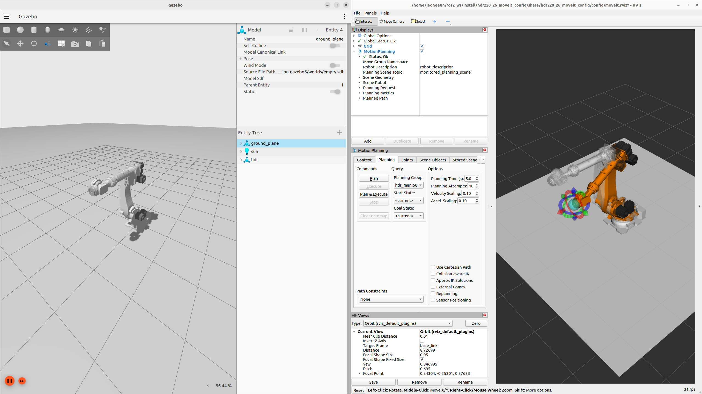

# HD Hyundai Robotics Simulation GZ

## Table of Contents

- [Overview](#overview)
- [Package Structure](#package-structure)
- [Installation](#installation)
- [Usage](#usage)
- [Trouble Shooting](#trouble-shooting)
- [Package Metadata](#package-metadata)

---

## Overview
<div align="center"></div>

This project provides a ROS2 Gazebo simulation environment for HD Hyundai Robotics robots.<br>
This package provides a **ROS2 + Gazebo (Ignition)** simulation environment for HD Hyundai Robotics industrial robots.<br>
It includes launch scripts and configuration files for spawning robot models and interfacing with Gazebo using `gz_ros2_control`.

---

## Package Structure

| Directory | Description |
| --------- | ----------- |
| `config/` | YAML configuration files for ros2 controllers. |
| `launch/` | Launch files for running simulation nodes and controllers. |

---

## Installation

### Prerequisite ROS2 Packages (Manual Installation Required)

The following ROS2 packages **must be manually cloned and built** from source:

- `hdr_description`  Clone and build from source: [[hdr_description](https://github.com/hyundai-robotics/hdr_description)]
- `hdr_client_driver`  Clone and build from source: [[hdr_client_driver](https://github.com/hyundai-robotics/hdr_client_driver)]
- `hdr_ros2_driver`  Clone and build from source: [[hdr_ros2_driver](https://github.com/hyundai-robotics/hdr_ros2_driver)]

### Build the package

#### Create a ROS2 workspace

```bash
# Skip if you already have a workspace
mkdir -p ~/ros2_ws/src/
```

#### Clone the latest repositories

```bash
cd ~/ros2_ws
git clone https://github.com/hyundai-robotics/hdr_simulation_gz src
```

#### Install ROS dependencies

```bash
rosdep update
rosdep install --from-paths src --ignore-src --rosdistro $ROS_DISTRO -y
```

#### Build and source environment

```bash
colcon build --symlink-install --cmake-args=-DCMAKE_BUILD_TYPE=Release
source install/setup.bash
```

---

## Usage

### Example

#### Spawn a HDR robot in Gazebo with the ROS2 controller

```bash
ros2 launch hdr_simulation_gz hdr_gz_spawn.launch.py robot_model:=ha006b
```

#### Using MoveIt with simulated robot

```bash
ros2 launch hdr_simulation_gz hdr_gz_moveit.launch.py robot_model:=ha006b
```
Within the `hdr_ros2_driver` repository, the `{robot_model}_moveit_config` package loads and applies MoveIt configuration files, including the SRDF, controller settings, and kinematic parameters.

#### Example for Trajectory Execution

```bash
ros2 action send_goal /joint_trajectory_controller/follow_joint_trajectory control_msgs/action/FollowJointTrajectory "{
  trajectory: {
    joint_names: ['j1', 'j2', 'j3', 'j4', 'j5', 'j6'],
    points: [{
      positions: [0.0, 1.571, 1.0, 0.0, 0.0, 0.0],
      time_from_start: {sec: 2, nanosec: 0}
    }]
  }
}"
```

### Configuration Options

| Argument name | Type | Default | Description |
| --- | --- | --- | --- |
| `robot_model` | string | `ha006b` | HDR robot model to use. Change `robot_model` to one of the supported models [`ha006b`, `hdf7_9`, `hdf8_8`, `hdr50_22`, `hdr220_26`, `hh020`] |
| `use_sim` | bool | `true` | Enables simulation mode using the `gz_ros2_control/GazeboSimSystem` plugin, typically for integration with Ignition Gazebo. The `use_sim_time` parameter is also set to true to synchronize with simulation time |
| `runtime_config_package` | string | `hdr_simulation_gz` | Name of the package providing controllers configuration |
| `controllers_file` | string | `hdr_controllers.yaml` | YAML file name defining which controllers to load |
| `description_package` | string | `hdr_description` | Description package with robot URDF files. Usually the argument is not set, enabling use of a custom description |
| `description_file` | string | `hdr.urdf.xacro` | URDF/XACRO file to use for the robot description |
| `initial_positions_file` | string | `initial_positions.yaml` | YAML file specifying the initial joint positions of the robot, located in the `{robot_model}_moveit_config/config/` directory |
| `kinematics_file` | string | `kinematics.yaml` | YAML file name defining the robot kinematics, located in the `{robot_model}_moveit_config/config/` directory |

---

## Package Metadata

- **Maintainer**: HD Hyundai Robotics R&D Team
- **License**: This project is licensed under the BSD 3-Clause License - see the [[LICENSE](LICENSE)]
- **Contact**: [vewry12@hd.com]